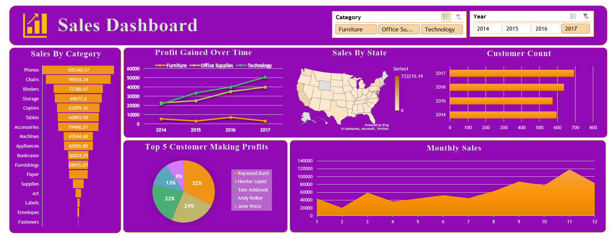

## 📊 **Sales Dashboard - Data Analysis Project**

A visually appealing and interactive **Sales Dashboard** created using **Microsoft Excel** to analyze and summarize business performance. This project demonstrates the potential of Microsoft Excel to transform raw data into actionable insights. 📈✨

### 📜 **Project Overview**

The **Sales Dashboard** provides an in-depth analysis of company sales data, offering a seamless way to track performance metrics and identify trends. Key metrics visualized include:

✅ **Sales by Product Categories and States**  
✅ **Profit Trends Over Time**  
✅ **Top Customers by Profit Contribution**  
✅ **Monthly and Yearly Sales Patterns**

This dashboard empowers organizations to make **data-driven decisions** for enhanced growth and customer satisfaction. 🌟

### ✨ **Key Features**

- **Category-wise Sales**: 🛋️💻 Analyze sales across categories such as **Furniture**, **Office Supplies**, and **Technology** with detailed bar charts.  
- **Profit Gained Over Time**: 📉 A line chart to track profit trends from **2014 to 2017** for better forecasting.  
- **Geographical Insights**: 🌎 A heatmap showcasing state-wise sales performance for strategic targeting.  
- **Customer Analysis**: 🎯 Highlight top customers contributing to profits through an engaging pie chart.  
- **Monthly Sales Trends**: 📆 Visualize seasonal patterns with a clear area chart.  
- **Interactive Filters**: 🗂️ Utilize slicers to filter data dynamically by **Year** and **Category**.

### 🔍 **Insights Uncovered**

1. **Top-Performing Categories**: 📊 Technology leads in profits, followed by Office Supplies.  
2. **Geographical Hotspots**: 📍 States with high sales volumes identified for targeted strategies.  
3. **Seasonal Sales Trends**: 🗓️ Peak sales observed during the last quarter of the year.  
4. **Customer Contributions**: 🧑‍🤝‍🧑 Top 5 customers accounted for a significant portion of profits.  

### 🛠️ **Tools and Technologies Used**

- **Power BI**: For creating interactive and dynamic visualizations.  
- **Excel**: 🖥️ For initial data preparation and formatting.  
- **Python**: 🐍 For advanced data preprocessing.  

### 📂 **How to Use the Dashboard**

1. 📥 **Download the Repository**: Clone this repo or download all files.  
2. 🖥️ **Open in Power BI**: Load the dataset into Power BI Desktop.  
3. 🔍 **Explore Insights**: Interact with slicers and charts to analyze key metrics dynamically.  

### 🎯 **Project Objective**

The goal of this project is to showcase how Power BI can be utilized as a powerful tool for **data visualization and business analytics**. This dashboard serves as a solution to gain meaningful insights into sales performance and optimize strategies.

### 🖼️ **Dashboard Preview**

### 🌟 **Why This Project Matters**

This dashboard provides businesses with:  
📌 Clarity on sales and profit trends across categories and regions.  
📌 Actionable insights to enhance customer satisfaction and profitability.  
📌 A user-friendly interface for exploring data efficiently.  

If you find this project helpful, don’t forget to ⭐ **star** the repository! 😊
